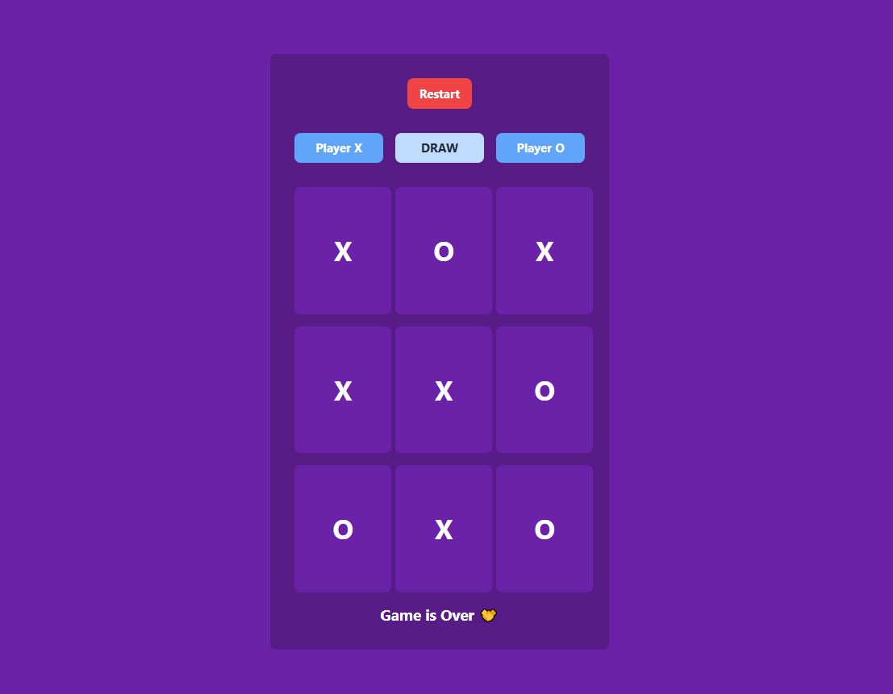

# Tictactoe-game
This project is a simple implementation of the classic Tic-Tac-Toe game using React. The application allows two players to take turns and play the game, and it announces the winner or a draw when the game ends.

Features

Two-player mode

Winner announcement

Draw detection

Responsive design

Clean and modular code structure.
How to Play

The game starts with Player X's turn.

Click on an empty square to place your mark (X or O).

The game automatically switches turns between players.

The first player to align 3 marks (horizontally, vertically, or diagonally) wins.

If all squares are filled without a winner, the game ends in a draw.

## Preview

